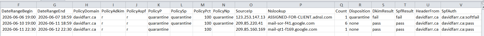

# DMARC Report Tools

This repository contains PowerShell helper scripts for working with DMARC aggregate report files.

## `run_dmarc_workflow.ps1`

Runs the full workflow for a DMARC report folder.

Usage:
```powershell
.\run_dmarc_workflow.ps1 'C:\path\to\folder' 'C:\path\to\output.csv'
```

Parameters:
- `Path` - Directory to scan for archive files and DMARC XML reports.
- `OutputFile` - CSV file path where parsed report rows will be written.

Sample output file:


Behavior:
- Extracts supported archives in the folder, deleting archive files after extraction.
- Parses extracted DMARC XML files in the same folder.
- Writes parsed rows to the specified CSV file.
- Deletes processed XML files after parsing.

Known limitations:
- `.tar.gz` and `.tar.bz2` extraction require the external `tar` command to be available.
- ZIP extraction uses the Windows Shell COM object, which is only available on Windows.
- `.gz` extraction works on all platforms with automatic fallback from `gzip` command to .NET GZipStream.
- If the output CSV path is invalid or not writable, the workflow may fail.

## Helper Scripts
The main script `run_dmarc_workflow.ps1` uses the following helper scripts. These scripts can be run independently if so desired.


### `extract_files.ps1`
Extracts archive files from a given directory.

Supported archive types:
- `.zip`
- `.gz`
- `.tar.gz`
- `.tar.bz2`

Usage:
```powershell
.\
extract_files.ps1 -Directory 'C:\path\to\archives' -DeleteOriginal $false
```

Or:
```powershell
.\
extract_files.ps1 'C:\path\to\archives'
```

Parameters:
- `Directory` - Directory to scan for supported archive files.
- `DeleteOriginal` - Optional. If set to `$true`, deletes archive files after extraction.

Notes:
- This script can be used as a standalone script if you just want to extract archived files.
- Archives are extracted into a subfolder named after the archive base name.
- This script does not recurse into subdirectories.
- It only supports `.zip`, `.gz`, `.tar.gz`, and `.tar.bz2` archives.
- `.gz` file extraction uses the `gzip` command if available (macOS, Linux, or Windows with gzip), otherwise it falls back to .NET's GZipStream, which requires .NET to be installed.

Troubleshooting:
- Ensure the directory path is valid and contains supported archives.
- `tar` must be available in your PowerShell environment for `.tar.gz` and `.tar.bz2` extraction.
- `.gz` extraction works on all platforms; if `gzip` is not available, the script will use .NET GZipStream automatically.
- If extraction fails, inspect the error message and verify the archive is not corrupted.

### `parse_dmarc_report.ps1`
Parses DMARC aggregate report XML files and optionally exports the extracted records to CSV.

Usage examples:
```powershell
.\parse_dmarc_report.ps1 -Path 'C:\Users\farr_\Downloads\google.com!davidfarr.ca!1780704000!1780790399.xml' -OutputCsv 'C:\Users\farr_\Documents\DMARCreports.csv'
```

```powershell
.\parse_dmarc_report.ps1 -Path 'C:\Users\farr_\Downloads' -Recursive $true -OutputCsv 'C:\Users\farr_\Documents\DMARCreports.csv'
```

Parameters:
- `Path` - File or directory path to read DMARC XML files from.
- `Recursive` - Optional. If `$true`, searches subdirectories for `.xml` files.
- `OutputCsv` - Optional. Path to write parsed report rows as a CSV file.
- `DeleteOriginal` - Optional. If `$true`, deletes processed XML files after parsing.

Behavior:
- If `OutputCsv` exists, the script appends new rows to the end of the file. Otherwise, it creates the file.
- Each record includes a new `NSLOOKUP` field resolved from the record's `source_ip`.
- The parser also converts Unix timestamp ranges into local date/time values.

Known limitations:
- `NSLOOKUP` must be available in the runtime environment. If it is not installed, the script may return an error or return raw output.
- DNS lookups can slow processing, especially for many report records.
- The script assumes DMARC XML files use the aggregate report schema with `<feedback>`, `<report_metadata>`, `<policy_published>`, and `<record>` elements.

Troubleshooting:
- If the script reports `No DMARC XML files found`, verify the `Path` and file extensions.
- If a file fails to parse, inspect the XML structure for missing or unexpected elements.
- If CSV output is not created, ensure `OutputCsv` is a valid file path and the folder is writable.
- Run with explicit execution policy if needed:
  ```powershell
  powershell -NoProfile -ExecutionPolicy Bypass -File .\parse_dmarc_report.ps1 ...
  ```

## Notes
- Both scripts were created for manual use in a Windows PowerShell environment.
- The shortcut file `Log_DMARC_Reports.lnk` can have its properties modified to run the `run_dmarc_workflow.ps1` script repeatedly *without* having to type the parameters each time.
- If you modify either script, test on one file or directory first before processing larger batches.
